# Screenshots

Reference captures of every major screen, rendered from the prototype at 1280×auto (desktop) or 390×auto (mobile) and scaled to ~900px wide for preview.

## Landing & role selection

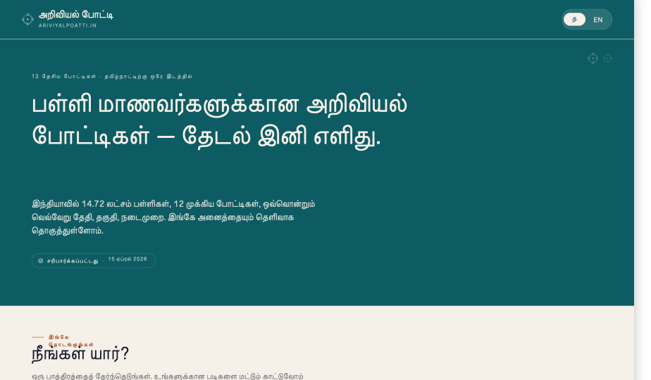
**01-home-desktop** · `home` route · desktop. Hero + three role cards + escape row + freshness pill.

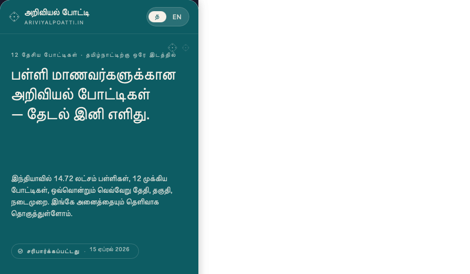
**02-home-mobile** · `home` route · 390px mobile. Single-column role cards.

## Role dashboards (primary flow)

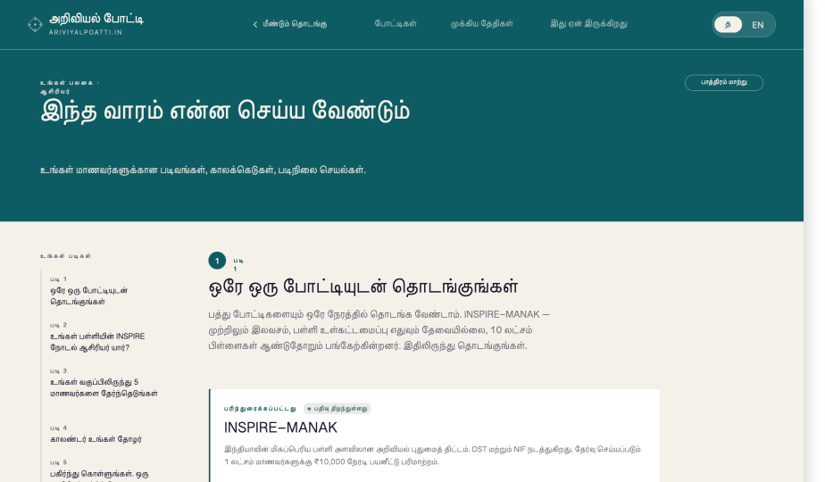
**03-dashboard-teacher** · `dash:teacher` · "What to do this week" + recommended competitions + calendar snippet.

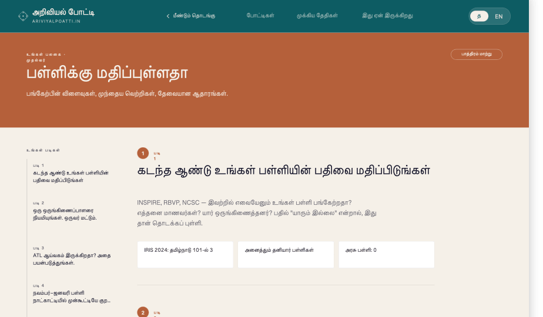
**04-dashboard-principal** · `dash:principal` · Cross-comp comparison + budget/pathway slants.

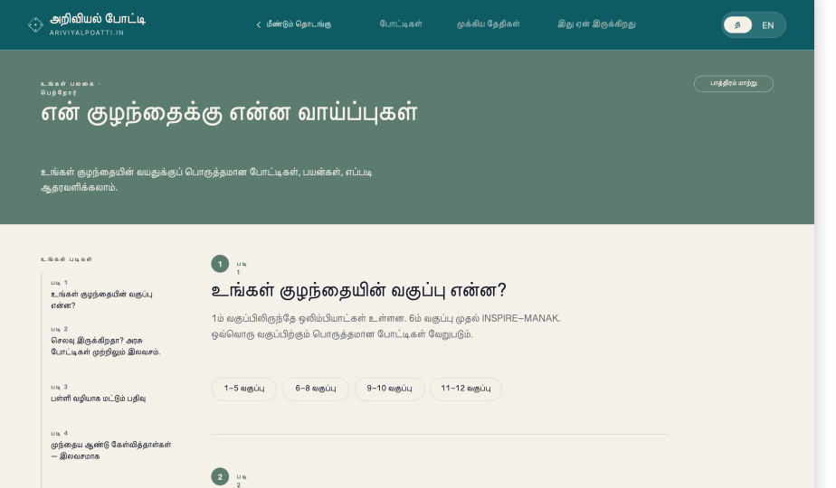
**05-dashboard-parent** · `dash:parent` · Worth-it-ness framing + commitment level.

## Competitions

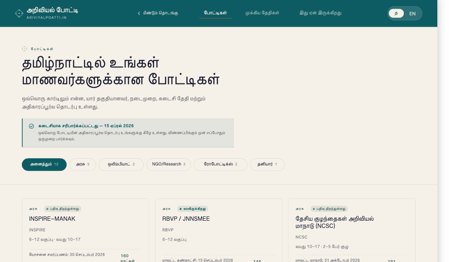
**06-competitions-list** · `competitions` route · all 12 with category filters and freshness banner.

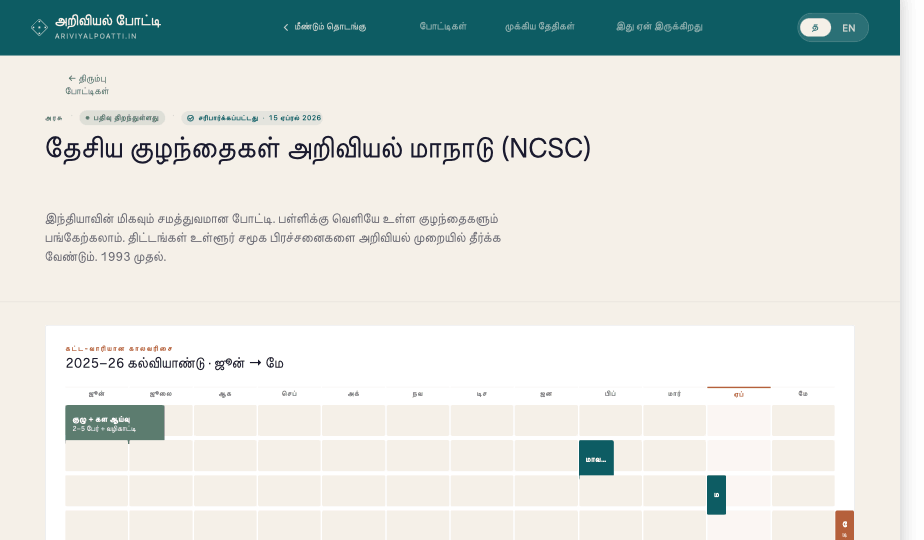
**07-detail-ncsc** · `comp:ncsc` · hero + phase timeline + TN participation + process + sidebar.

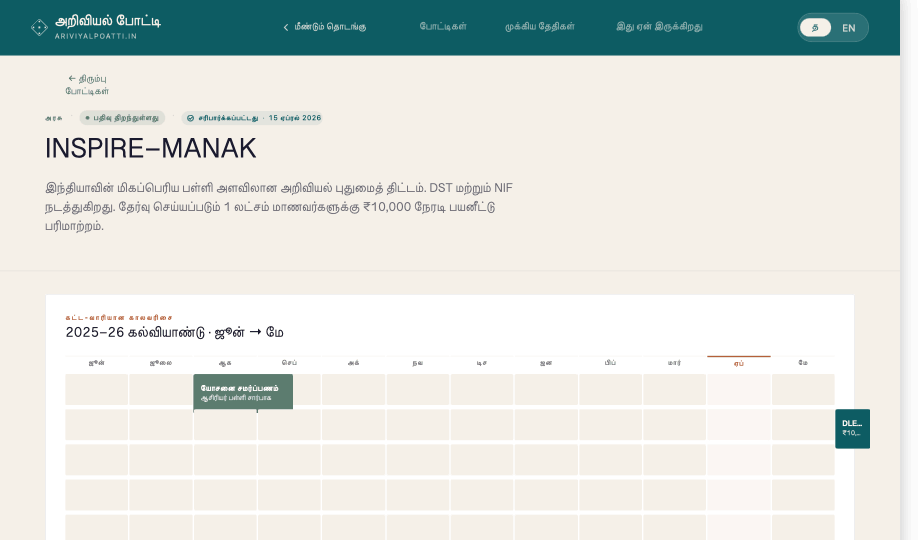
**08-detail-inspire-manak** · `comp:inspire-manak` · government-category detail example.

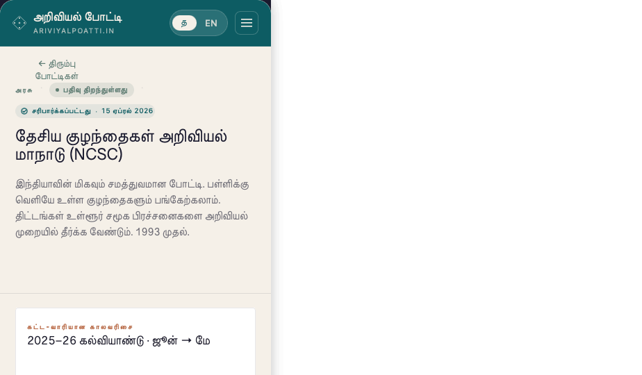
**09-detail-ncsc-mobile** · mobile stacked layout of the detail page.

## Supporting pages

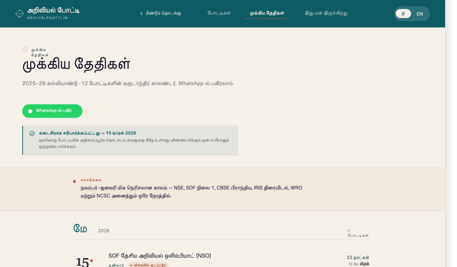
**10-annual-calendar** · `dates` · month-grouped vertical timeline across the academic year.

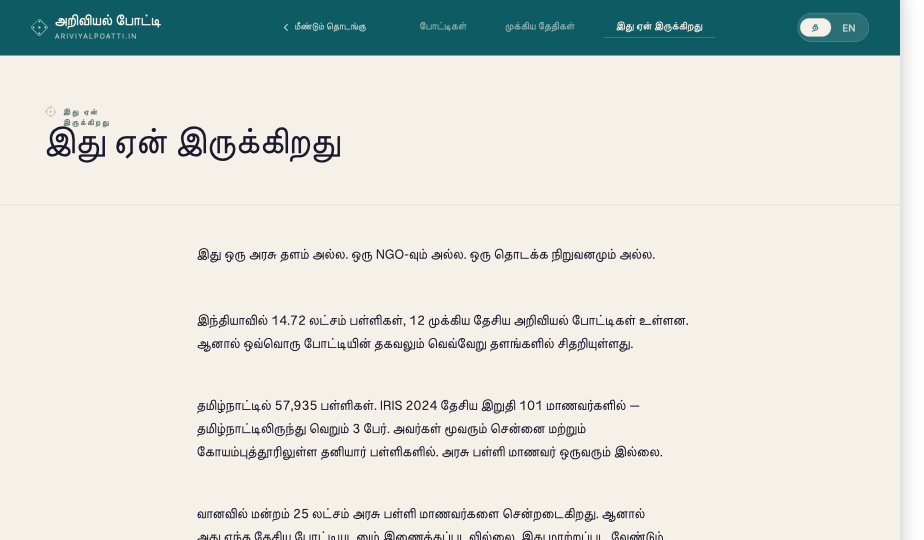
**11-about** · `about` · mission, TN context, sources.

---

These captures are pixel snapshots — for live interaction (language toggle, nav, filter), open `design_reference/Ariviyal Poatti.html` in a browser.
